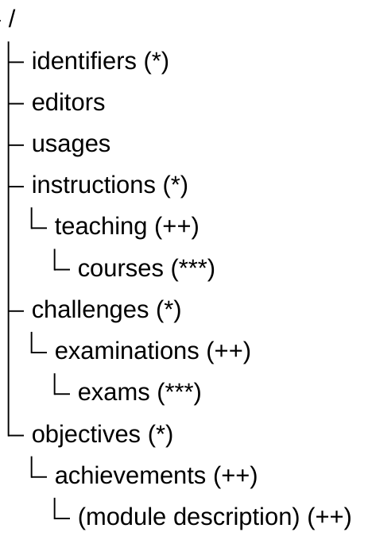

# Moduls

According to legal foundations every curriculum is created out of modules. A module itself is defined as a closed peace of education. 

:::warning
This approach assumes independent curricula and therefore modules as a component of a specific curriculm (one-to-many relation). In practice - for reasons - modules are very often reused in several curricula. One example are elective modules (general studies). This ends in a many-to-many relation between curriculum and module and two different perspectives on the term *module*:

- **content-oriented** perspective: teaching, examination, objectives, etc. in general topics of quality management and *accredition*.
- **organisational-oriented** perspective: position, role and framework, etc. in general topics of *Prüfungsordnungen*.

Within hamSTER the **organisational** perspective is interpreted as *objective* or *requirement* where as the **content-oriented** perspective is interpreted as *fulfillment* or *offer*. For naming the relationship between both perspectives the term *accredition* is used.
:::

This chapter describes the **content-oriented** perspective.

## Naming conventions

Departments are responsible for their own portfolio of lecture. Therefore departments are maintaining modules organised in module catalogs. A module is identified by an aggregated key created out of 4 elements.

|Attribute | Description |
|----|----|
| Institution | |
| Department | |
| Catalog | curriculum, package, discipline |
| Topic | incl. version number|

Using the version number is an option.

:::info
There is no historization concepts for modules. Once established, modules are immutable. See [...]
:::

## Access rights

| Role | Description |
|----|----|
| Member | creating a module, becoming module responsible |
| Module responsible | changing own module |
| Catalog responsible | changing modules with the catalog |
| Currciculum admin | creating catalogs |

Depending on modules are *accreditated* or not the access to some elements is limited.

## Structure

A module is a complex aggregate. In practice every level of sub component is representing a dimensions of flexibility.

:::info
The *default* module: mandatory, 1 lecture, 1 lecturer, 1 course, 1 exam, fixed content (in general modules like mathematics in fundamental phase of a curriculum).
The *practice*:
- one or more subjects, may be with different names and different examination formats
- subjects distributed over several semesters, but only one examination
- usage of taxonmies, more or less detailed
- and many more
:::

### Blueprint (*)

Attributes of *accreditated* moduls cannot be changed! A copy is required!

### Instances (++)

Information on instance level may vary from semester to semester.

### Implementation (***)

The implementation level (courses) may exist on its own without connection to modules.
On the hand: moduls may exist without and implementation.

Instances are the "missing link", connecting blue print and implementation.
